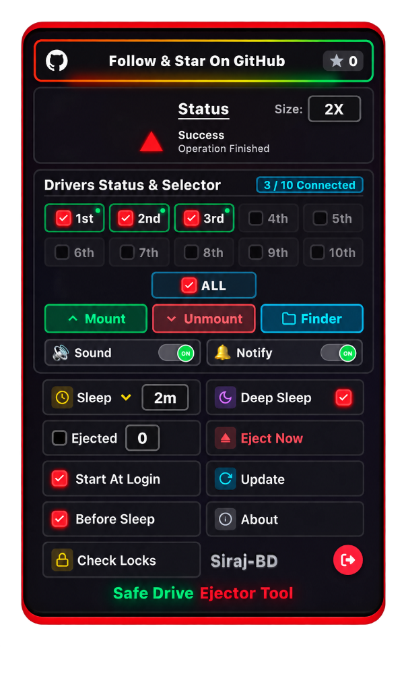
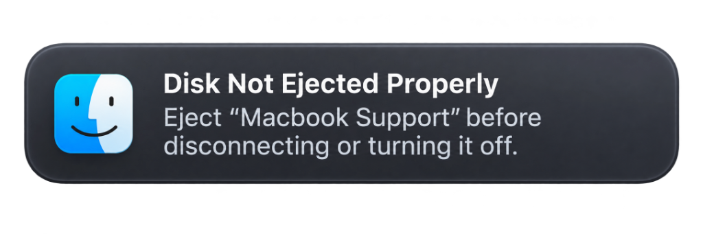

# Safe Drive Ejector Tool

<div align="center">

[](LICENSE)
[](#platform-support)
[](https://www.python.org/)
[](https://swift.org/)
[](#running-automated-tests)
[](https://github.com/siraj-bd/Safe-Drive-Ejector-macOS)

**A lightweight, premium native macOS Menu Bar utility that automatically and safely ejects external disks before system sleep, gracefully closes blocking applications, and re-mounts drives upon wake.**

[Key Features](#key-features) • [The Solution](#the-ultimate-solution-safe-drive-ejector-tool) • [UI Overview](#ui-overview) • [Installation](#installation--first-time-launch) • [Quick Start](#quick-start) • [Configuration](#configuration) • [Contributing](#contributing)

<br />

<p align="center">
  
</p>

</div>

---

## 🛑 The Core Problem: "Disk Not Ejected Properly"

<p align="center">
  
</p>

### Have you ever faced this situation?
You close your MacBook lid, step away from your desk, or your Mac enters system sleep — and when you return, macOS bombards your screen with the dreaded alert:

> ⚠️ **Disk Not Ejected Properly**  
> *Eject "Macbook Support" before disconnecting or turning it off.*

### Why is this extremely dangerous?
1. **Application Crashes & Freezing:**  
   If you install and run apps (like Google Chrome, Brave, Firefox, code editors, databases, or virtual machines) directly on an external SSD/HDD, an abrupt disk disconnect causes those apps to **instantly crash, freeze, or corrupt their user profiles and open tabs**.
2. **Silent Data Corruption & File Loss:**  
   Modern operating systems buffer writes in memory. When macOS cuts power to USB/Thunderbolt ports during sleep, any unsaved work or uncommitted cache is permanently lost, damaging APFS and exFAT file system structures.
3. **Hardware & Controller Degradation:**  
   Sudden power cuts shock external SSD NVMe bridge controllers and force mechanical HDD heads to emergency-park, degrading drive health over time.

---

## 💡 The Ultimate Solution: Safe Drive Ejector Tool

**Safe Drive Ejector Tool was built specifically to solve this exact problem once and for all.**

Operating seamlessly from your macOS Menu Bar, it works automatically in the background:

- 🛡️ **1. Auto Pre-Sleep Interception:** Intercepts system sleep commands *before* macOS cuts power to USB ports.
- 🛑 **2. Smart Graceful App Shutdown:** Automatically identifies open applications, browsers, files, or background processes reading from or installed on the external drive, and gracefully requests them to save and close (`AppleScript`). **No apps crash, no sessions are lost!**
- ⚡ **3. Cache Flushing & Clean Unmount:** Forces disk write buffers to flush safely (`sync`) and cleanly unmounts all managed partitions.
- 💤 **4. Hardware Silence & Deep Sleep:** Powers down controller activity and turns off external drive LEDs.
- 🔄 **5. Seamless Auto-Wake:** The moment you open your MacBook lid or touch your trackpad, your drives are automatically re-mounted and ready to use!

---

## Key Features

- **Smart Graceful App Shutdown (Auto System)**:
  Before unmounting, sleeping, or ejecting a drive, SafeEject inspects all open processes using the volume (`lsof` / `fuser`). It politely requests applications (browsers, editors, terminals, Finder windows) to save and close cleanly via AppleScript with a 1.5-second grace period, then safely cleans up remaining locks. This ensures applications running from external drives **never freeze or crash**.
- **10-Drive Matrix Grid (`1st` to `10th` + `{ALL}`)**:
  Modern 2-row multi-drive selector supporting up to 10 connected external disks simultaneously. Each slot displays real-time mount and power status dots:
  - 🟢 **Green**: Mounted and actively accessible.
  - 🟡 **Amber / Yellow**: In Sleep / Unmounted state.
  - ⚪ **Gray**: Slot unoccupied.
- **Dedicated Batch Action Center**:
  High-visibility, color-coded batch control strip:
  - 🟢 **Mount**: Instantly mounts all checked drive slots.
  - 🔴 **Unmount**: Cleanly unmounts all checked drive slots.
  - 🔵 **Finder**: Opens selected mounted volumes in macOS Finder.
- **Strict Drive Selection Guard**:
  Clicking `Mount`, `Unmount`, or `Finder` without selecting at least one drive slot (or `{ALL}`) triggers an interactive red shake warning, notification banner, and alert chime—preventing accidental drive actions.
- **Micro Audio & Notification Toggles**:
  Compact switches right on the card for instant personalization:
  - **Sound**: Micro toggle with live indicator for UI click chimes and alerts.
  - **Notify**: Micro toggle with live indicator for desktop notifications.
- **Hardware Deep Sleep & Silence (LED Off)**:
  Cleanly flushes write buffers, tears down APFS/HFS+ containers (`diskutil unmountDisk`), and puts external disks and USB bridges into true hardware silence with **LED lights turned OFF** and zero background polling.
- **Normal Sleep vs Deep Sleep vs Eject Now**:
  - *Normal Sleep*: Unmounts target partitions while keeping hardware standby ready for quick touch-wake.
  - *Deep Sleep*: Complete container teardown and parent drive detachment (`diskutil eject`).
  - *Eject Now*: Instant one-click safe detachment sweep for all connected external storage.
- **Active Lock Inspector (`Check Locks`)**:
  Built-in live diagnostic scanner that identifies exactly which processes, PID numbers, or apps are holding files open on an external drive.
- **Dynamic Scale Selector (1X, 1.25X, 1.5X, 2X)**:
  Responsive zoom scaling tailored for any display resolution or viewing distance, rendered with a crisp, borderless, zero-shadow Swift window framing.
- **Safe Ejection Before Sleep & Logout**:
  Configurable background hooks (`Before Sleep`, `Before Logout`) that trigger automatic unmounting before macOS transitions into low-power states.
- **Zero Heavy Dependencies**:
  Core engine uses native macOS system utilities (`diskutil`, `IOKit`, `osascript`) with no required third-party Python packages.

---

## Platform Support

| Operating System | Menu Bar App | CLI / Background Daemon | Smart App Shutdown | Auto Sleep / Wake | Architecture |
| :--- | :---: | :---: | :---: | :---: | :---: |
| **macOS 12.0+ (Monterey, Ventura, Sonoma, Sequoia, Golden Gate & all modern versions)** | :white_check_mark: Native Swift | :white_check_mark: Python 3 | :white_check_mark: AppleScript + POSIX | :white_check_mark: Full Support | Universal 2 (Apple Silicon & Intel) |

---

## UI Overview

The floating menu bar card provides complete visibility and control over your external storage:

```text
+-------------------------------------------------------------+
|  [GitHub]  Follow & Star On GitHub                      ★ 1 |
+-------------------------------------------------------------+
|  ● System Active                         Scale: [ 1.5X ▼ ]  |
+-------------------------------------------------------------+
|  [ ] 1st ●   [ ] 2nd ●   [ ] 3rd ●   [ ] 4th ●   [ ] 5th ●  |
|  [ ] 6th ●   [ ] 7th ●   [ ] 8th ●   [ ] 9th ●   [ ] 10th ● |
|  [ ] {ALL}                                                  |
+-------------------------------------------------------------+
|  [   Mount   ]     [  Unmount  ]     [   Finder   ]         |
+-------------------------------------------------------------+
|  [●] Sound                             [●] Notify           |
+-------------------------------------------------------------+
|  (⏰) Sleep [ 2m ▼ ]                  (🌙) Deep Sleep [✓]   |
|  ( ) Ejected [ 0 ▼ ]                  (▲) Eject Now         |
|  (✓) Start At Login                   (↻) Update            |
|  (✓) Before Sleep                     (ℹ) About             |
|  [🔍 Check Locks]                     Siraj-BD          [⎋] |
+-------------------------------------------------------------+
|                   Safe Drive Ejector Tool                   |
+-------------------------------------------------------------+
```

### UI Component Guide:
1. **GitHub Star Header**: Quick access to official updates, releases, and repository starring.
2. **Status & Scale**: Live engine activity status and dynamic UI scale dropdown (1X, 1.25X, 1.5X, 2X).
3. **10-Drive Matrix**: Individual checkboxes for drives 1 through 10, plus the `{ALL}` master selector. Green/Yellow status dots reflect real-time volume states.
4. **Batch Action Strip**:
   - `Mount` (Green): Mounts all checked drives.
   - `Unmount` (Red): Gracefully quits blocking apps and unmounts all checked drives.
   - `Finder` (Blue): Reveals all checked mounted volumes in Finder.
5. **Micro Toggles**: One-click toggles for `Sound` chimes and desktop `Notify` alerts.
6. **System Control Grid**:
   - `Sleep Timer`: Idle timeout dropdown (`2m`, `5m`, `10m`, `15m`, `30m`, `1h`, `2h`, `never`).
   - `Deep Sleep`: Toggles hardware silence mode (spins down platters and turns off drive LEDs).
   - `Eject Now`: Instant one-click safe detachment of all connected drives.
   - `Check Locks`: Live inspection scan of active processes holding files on the disk.
   - `Start At Login` & `Before Sleep`: Automated background lifecycle management.
   - `Quit [⎋]`: Safely closes the menu bar application.

---

## Installation & First-Time Launch

### Option A: Via Homebrew (Recommended)

Install the macOS Universal app directly using [Homebrew](https://brew.sh/):

```bash
brew install --cask siraj-bd/tap/safe-drive-ejector
```

Or add the tap first and install:

```bash
brew tap siraj-bd/tap
brew install --cask safe-drive-ejector
```

To update in the future:
```bash
brew upgrade --cask safe-drive-ejector
```

---

### Option B: Pre-Built Standalone Release (DMG)

Download the latest package from [GitHub Releases](https://github.com/siraj-bd/Safe-Drive-Ejector-macOS/releases):
- **macOS Universal (Apple Silicon M1/M2/M3/M4 & Intel)**: `SafeDriveEjector-1.0.0-macOS-Universal.dmg`

---

#### 🍎 macOS First-Launch Guide (Gatekeeper)

Safe Drive Ejector Tool is a 100% free, community open-source utility. Because it is distributed directly on GitHub without a paid Apple Developer certificate, macOS Gatekeeper may show a standard verification dialog on your first run:

> **"Safe Drive Ejector" Not Opened**  
> *Apple could not verify "Safe Drive Ejector" is free of malware that may harm your Mac or compromise your privacy.*

This is standard for open-source apps. You **do not** need to disable Gatekeeper or compromise system security.

**To Open (One-Time Setup):**

* **Method 1: Via System Settings (GUI)**
  1. Open the downloaded `.dmg` and drag **Safe Drive Ejector.app** into your **Applications** folder.
  2. Double-click **Safe Drive Ejector.app**. When the alert appears, click **Done**.
  3. Open **System Settings** (Apple Menu  > System Settings).
  4. Navigate to **Privacy & Security** and scroll down to the **Security** section.
  5. Under *"Safe Drive Ejector was blocked to protect your Mac"*, click **Open Anyway**.
  6. Enter your Mac password or use Touch ID, and click **Open**.

* **Method 2: Via Terminal (One Command)**
  ```bash
  xattr -d com.apple.quarantine "/Applications/Safe Drive Ejector.app"
  ```
  The app will now launch seamlessly from Applications, Spotlight, or your top status bar on every boot!

---

### Option B: Build From Source

#### 1. Clone the Repository
```bash
git clone https://github.com/siraj-bd/Safe-Drive-Ejector-macOS.git
cd Safe-Drive-Ejector-macOS
```

#### 2. Prerequisites
- macOS 12.0 or later
- Python 3.9+ (bundled or system Python)
- Xcode Command Line Tools (`xcode-select --install`)

---

## Quick Start

### Running the macOS Menu Bar App
Compile the native Swift status bar utility and launch it:
```bash
# Build native Swift binary
swiftc -module-cache-path .build/cache -O ui/SafeEjectMenuBar.swift -o bin/SafeEjectMenuBar

# Launch the Menu Bar App
./bin/SafeEjectMenuBar
```

Or run the convenience launcher script:
```bash
chmod +x run_menubar_mac.sh
./run_menubar_mac.sh
```

### Using the Python CLI
You can also interact directly with the disk management engine via your terminal:

```bash
# Display JSON status of all connected external drives
python3 main.py json-status

# Inspect active file/process locks on a drive
python3 main.py check-locks disk8s1

# Put a drive into Normal Sleep
python3 main.py eject disk8s1

# Put a drive into Hardware Deep Sleep (LED off)
python3 main.py deep-sleep disk8s1

# Mount a previously unmounted drive
python3 main.py remount disk8s1

# Cleanly unmount a drive with Smart Graceful App Shutdown
python3 main.py eject disk8s1

# Safely eject all external drives
python3 main.py eject-all

# Remount all previously managed drives
python3 main.py remount-all
```

---

## Configuration

Settings are saved in standard JSON format:
- **macOS**: `~/.config/safe-eject/config.json`

Example configuration:
```json
{
  "start_at_login": true,
  "eject_before_sleep": true,
  "eject_before_logout": false,
  "deep_sleep_mode": true,
  "wake_mode": "touch",
  "sleep_timer_seconds": 120,
  "unmount_instead_of_eject": true,
  "remount_delay_seconds": 5,
  "excluded_volumes": [],
  "play_sounds": true,
  "show_notifications": true
}
```

---

## Running Automated Tests

A comprehensive unit test suite verifies engine integrity, process closure, sleep states, platform adapters, and data models:

```bash
python3 -m unittest discover tests
```

*Output: 83 tests passing (0 failures, 0 errors).*

---

## Contributing

Contributions are warmly welcome! Please read our [Contributing Guide](CONTRIBUTING.md) and [Code of Conduct](CODE_OF_CONDUCT.md) before submitting pull requests.

1. Fork the Project
2. Create your Feature Branch (`git checkout -b feature/AmazingFeature`)
3. Commit your Changes (`git commit -m 'Add some AmazingFeature'`)
4. Push to the Branch (`git push origin feature/AmazingFeature`)
5. Open a Pull Request

---

## Maintainer & Author

- **Siraj** — [GitHub Profile (@siraj-bd)](https://github.com/siraj-bd)
- **Repository** — [Safe-Drive-Ejector-macOS](https://github.com/siraj-bd/Safe-Drive-Ejector-macOS)

---

## License

Distributed under the **MIT License**. See [`LICENSE`](LICENSE) for more information.
